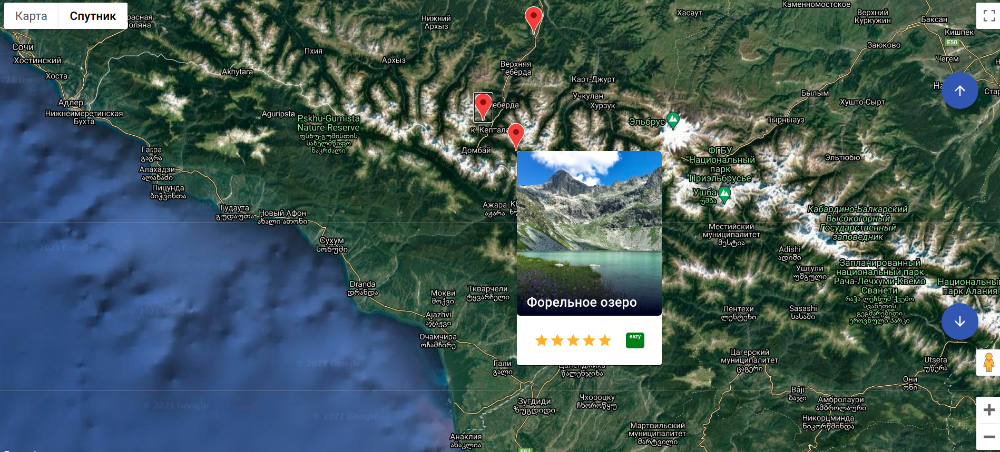
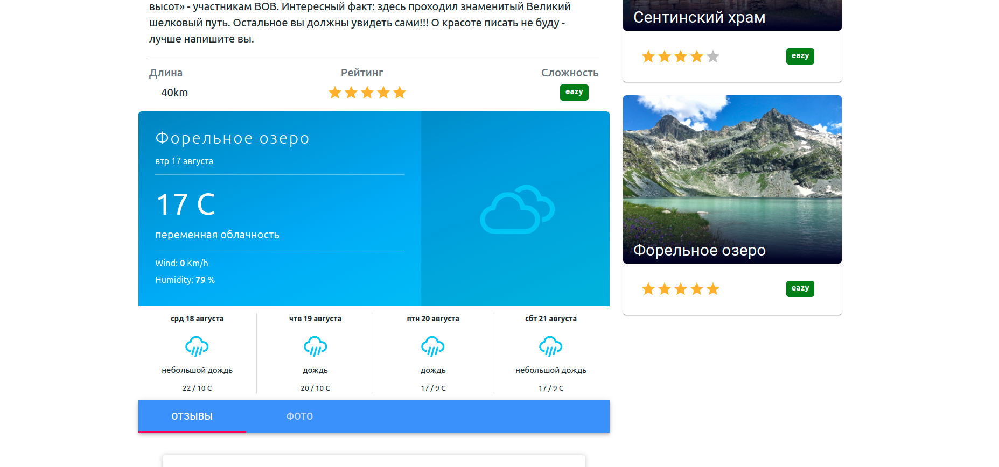

# PathFinder
​
Приложение по поиску и обмену туристическими маршрутами во всем мире. 
​
Введение
-----------
​

Рисунок 1. Главная страница
​

Рисунок 2. Маршруты отмеченные на карте
​

Функциональность
-----------
​
В данном приложении вы можете искать, добавлять, и делиться маршрутами. 
​

Рисунок 3. Страница маршрута
​
Запуск
-----------
В папках 
/backend
/frontend
​
запустить команду
​
```
npm i
npm start
